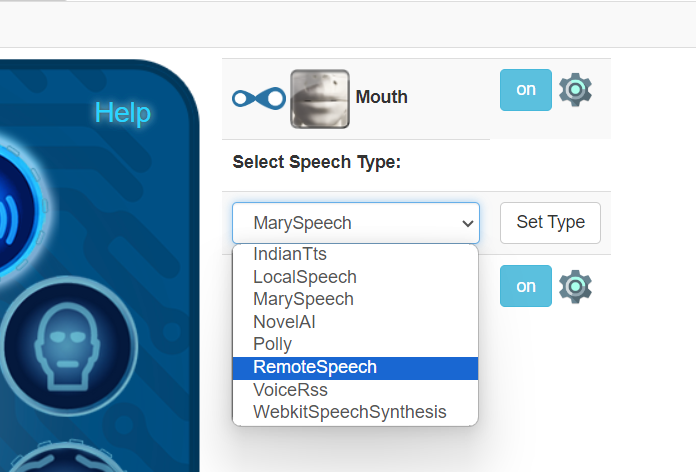
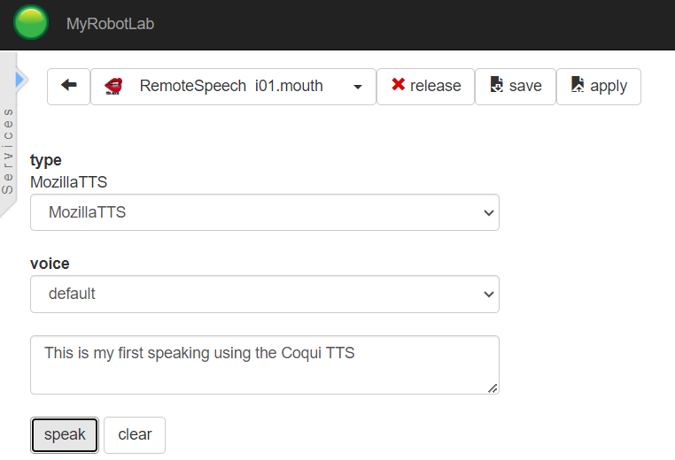
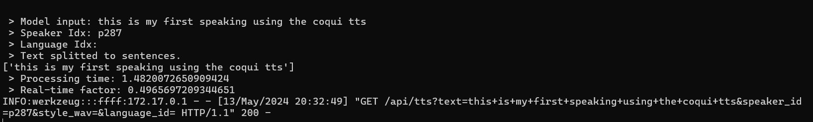

<!DOCTYPE html>
<html>
<head>
</head>
<body>

<h1>Coqui TTS install with MRL</h1>
<p>Test guide for using Coqui TTS with MyRobotLab</p>

<h2><p>Pre-requisites:</p></h2>
<p>MyRobot Lab installed <a href="https://myrobotlab.org">Download</a></p>
<p>Docker or Docker Desktop for Windows installed</p>
<p><p>


<h2>Running Coqui docker image:</h2>

<b>CPU Based:</b>
```
# Start the docker container for Coqui
docker run --rm -it -p 5002:5002 --entrypoint /bin/bash ghcr.io/coqui-ai/tts-cpu

# (optional) Generate a list of built-in voices
python3 TTS/server/server.py --list_models 

# Choose one of the below options for running the server
#An option for multi-speaker:
python3 TTS/server/server.py --model_name tts_models/en/vctk/vits   #(Note this is a multi-speaker voice so needs manual i01_mouth.yml updates)

#An option for single-speaker:
python3 TTS/server/server.py --model_name tts_models/en/ljspeech/fast_pitch
```

<b>GPU based:</b>
```
# Start the docker container for Coqui
docker run --rm -it -p 5002:5002 --gpus all --entrypoint /bin/bash ghcr.io/coqui-ai/tts</p>

# (optional) Generate a list of built-in voices
python3 TTS/server/server.py --list_models

#An option for multi-speaker :  
python3 TTS/server/server.py --model_name tts_models/en/vctk/vits --use_cuda true

# An option for single-speaker: 
python3 TTS/server/server.py --model_name tts_models/en/ljspeech/fast_pitch --use_cuda true
```

<b> Note on single or multi speaker models </b>
<p>When chosing a model to run above it needs to be noted whether the model contains a single or multi-speaker voices.  If multi-speaker than additonal parameters will need to be added to the default RemoteSpeech URL configuration manually (comparison covered below).</p>

<b>Verify working to to this point:</b>
<p>If the CoquiTTS server container is runnign properly at this point you can browse to <a href="http://localhost:5002">http://localhost:5002</a> and run TTS tests. </p>
<p></p>

<h2>Use CoquiTTS with MRL and RemoteSpeech option</h2>
<p>The built-in RemoteSpeech mouth function will call the coqui API on port 5002 with the /api/tts parameters for text. 

<p>In MRL: Select Mouth, then under type select RemoteSpeech.  At this point of the code only the default parameters are selectable (MozillaTTS, default voice).  Any changes we'll hardcode in the i01.mouth.yml file for proof of concept. </p>

<p></p>
<p>If you are using a multi-speaker model we need now to manually edit the i01.mouth.yml file to include the extra parameters. If you are using a single speaker voice this step can be skipped.</p>
<p>Editing i01.mouth.yml<p>

```
!!org.myrobotlab.service.config.RemoteSpeechConfig
blocking: false
listeners: [
  ]
mute: false
peers:
  audioFile:
    autoStart: true
    name: i01.mouth.audioFile
    type: AudioFile
  http:
    autoStart: true
    name: i01.mouth.http
    type: HttpClient
speechRecognizers:
- i01.ear
speechType: MozillaTTS
substitutions: null
template: null
type: RemoteSpeech
url: http://localhost:5002/api/tts?text={text}&speaker_id=p287&style_wav=&language_id=
verb: GET
voice: null
```

<p>For multi-speaker voice the speaker_id and style_wav parameters needed to be added to the URL line.</p>  
<p>Once changed apply the file to get it current in MRL</p>
<p>Now it's ready to test TTS MRL -> Coqui.</p>
<p>Select the gear icon for the mouth, type in some sample text and click Speak.  If all is working you should hear the audio played back in the default MRL output.  You can view the API call from the docker cli window running the API server. </p>

<b>Demo</b>
<a href="images/demo.mkv">Demo Video</a>
</body>
</html>


