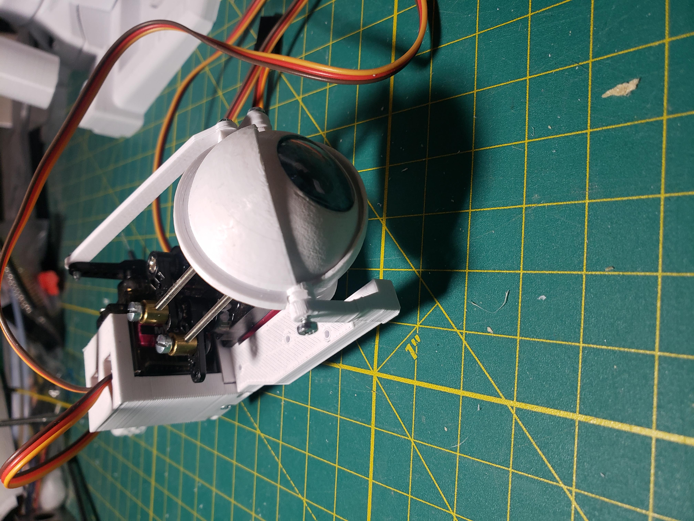

<!DOCTYPE html>
<html>
<head>
</head>
<body>

<h2>i2head assembly steps</h2>

My steps for assembly of the i2eyes. 

*** Disclaimer ***  This is not an official guide, just what I worked through during the intial release of the new i2head.

</a>

</body>

</html>
