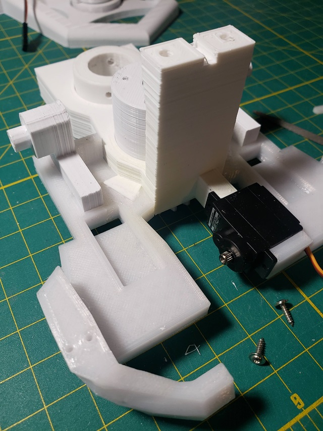
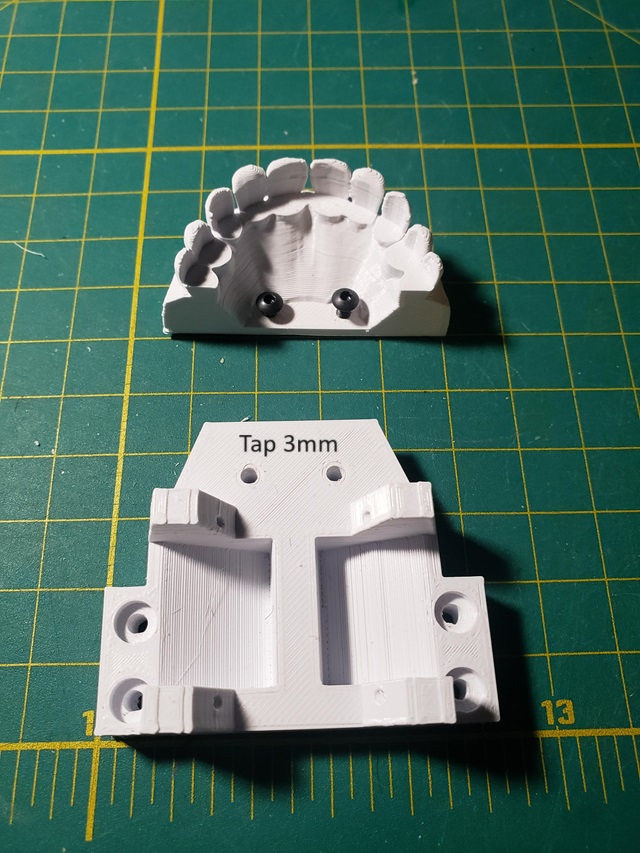
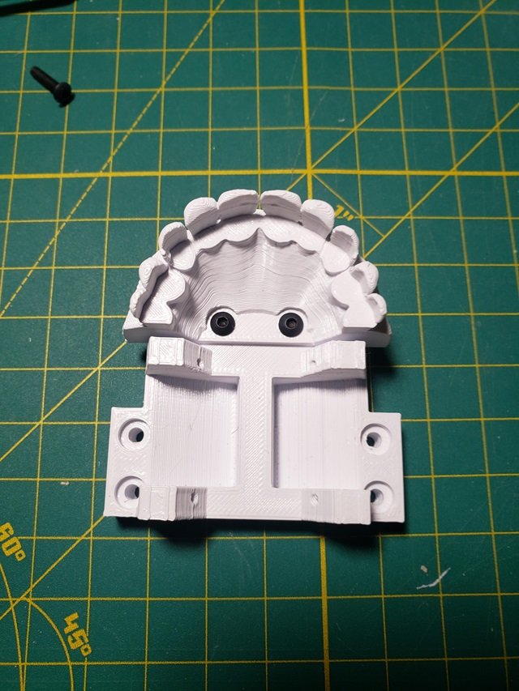
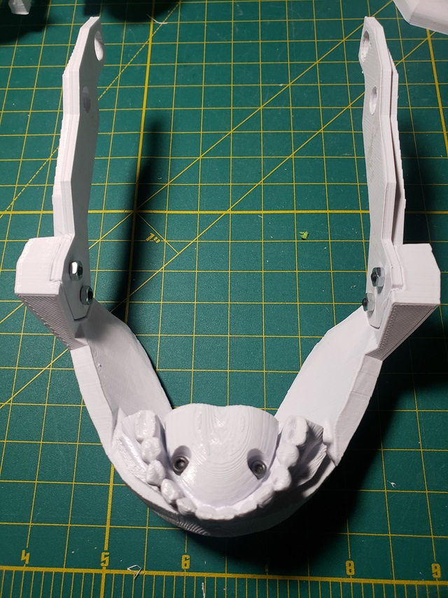
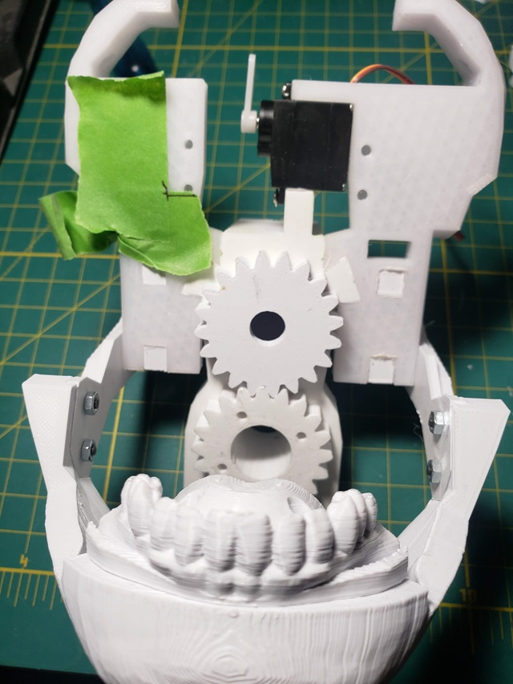
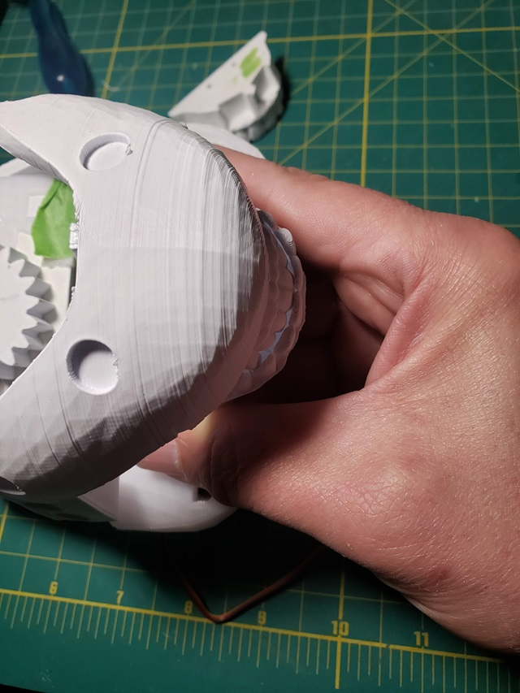
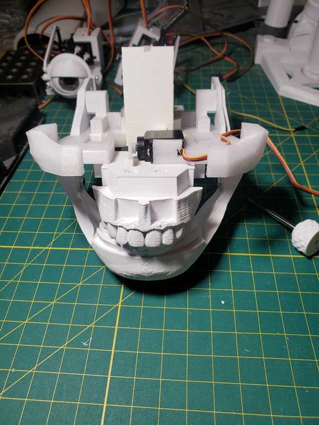
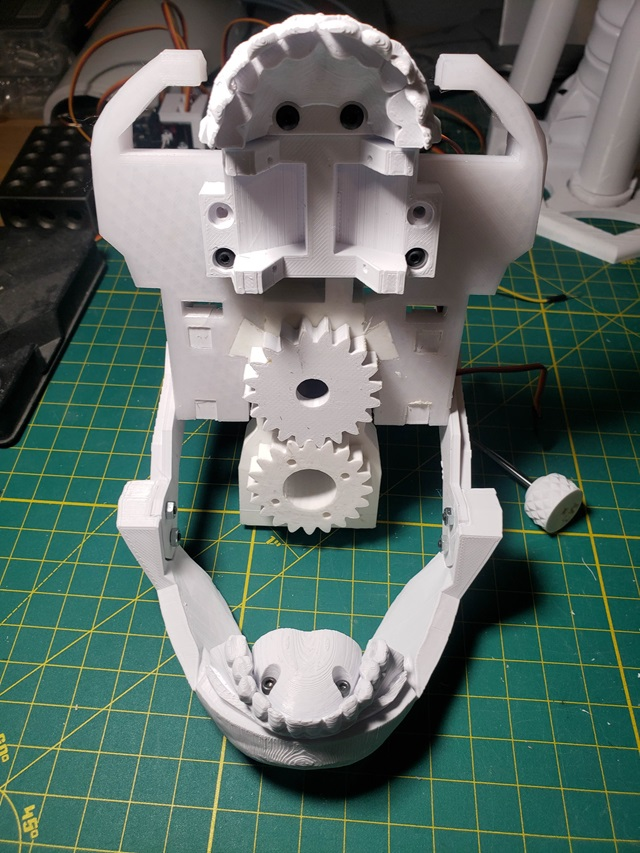
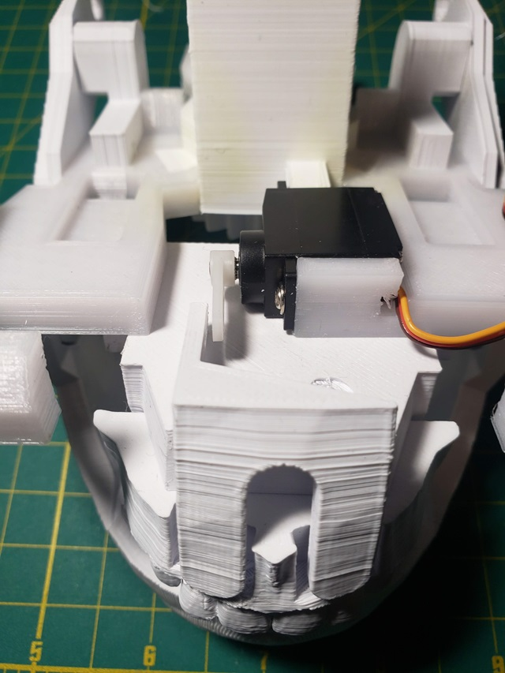

<!DOCTYPE html>
<html>
<head>
</head>
<body>

<h2>i2head assembly steps</h2>

My steps for assembly of the i2head. 

* * * Disclaimer * * *  This is not an official guide, just what I worked through during the intial release of the new i2head.

<h3>Parts and electronics</h3>

Servos

--- PDI-1109MG (qnty X) - I used these where height is crictial to match. They are more expensive than the MG90s

--- MG90s (qnty X)  - I used these everywhere else for the small servos.

<h3>Base</h3>

Fit FaceHolderLeft and FaceHolderRight to GearHolderV3.  These can then be glued to form a permanent assembly. 

Tap the 8 eye assembly mountings holes for 2mm screws

Suggest at this point test fit and sand the ServoGear and MainGear for a smooth fit and gear teeth action.

Notes if this is still an issue.  The mounting holes on the FaceHolderLeft and FaceHolderRight for the upper teeth plate are not aligned properly.  In the side by side photos the right is the original for clarity. The left with the indicated markings are where I redrilled once the lower jaw assembly was mounted.  

 
 

Mount left and right jaw hinges. Sand these as needed for an easy fit. You can see in my image I cracked the PETG forcing them in.  These can be glued.

  

Mount the upper lip servo PDI-1109MG.  This is another location where the MG90s servo is too tall and the offsets the upperlip piece too much.

 
 

Assemble upper teeth and plate. Tap 2 holes at 3mm or self thread.

  

Jaw Assembly

4 3mm x 8mm screws and nuts

  

Installing upper teeth assembly to faceholder assembly. This part might get resolved if the holes align for the teeth.

To determine the new upper teeth plate assembly I attached the jaw, aligned the upper teeth plate drawing a right angle of where one corner meets.  Easier than trying keep the assembly in place to drill a first hole.  

  

Jaw and teeth aligned

  

Alignment issue - upper lip

The pdi-1109mg is not much better aligned than the MG90s was.  With the shorter servo I need to make a spacer to shift the upper lip to align with the upper teeth

*** Steps being added here as rebuild continues ***

Much later....

Attach completed eye assemblies from i2eyes guide using 2mm x 8mm screws

</body>

</html>

