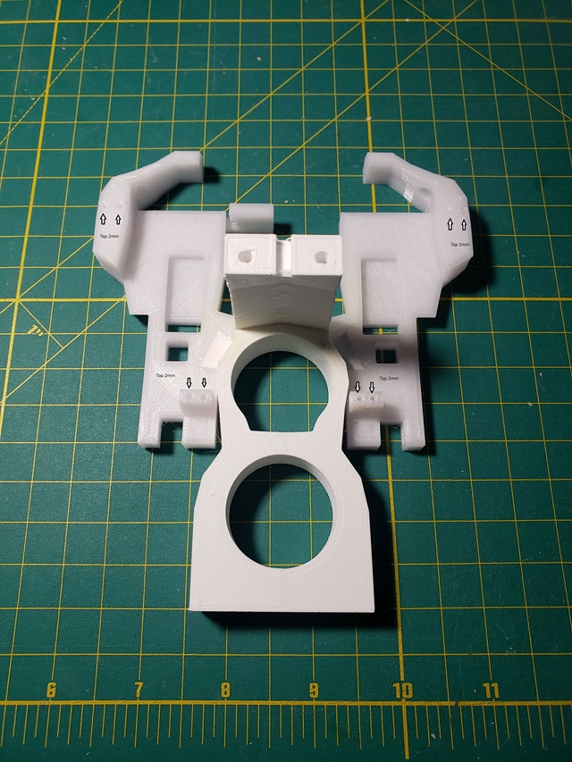
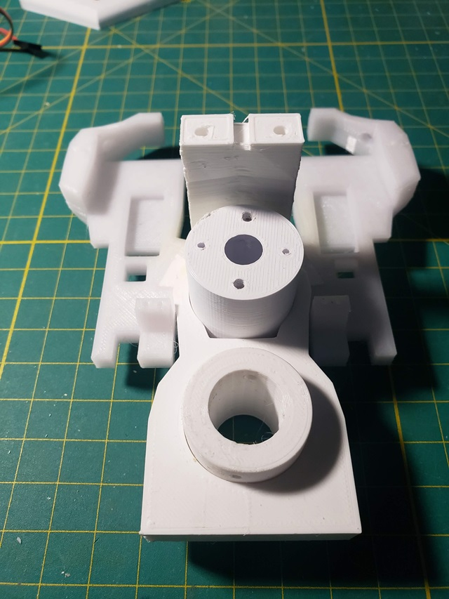
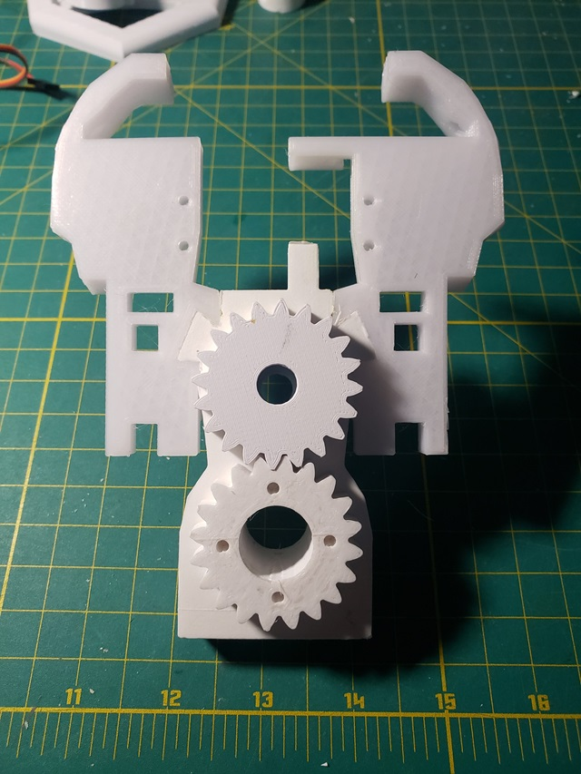
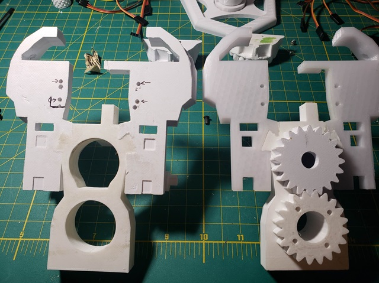
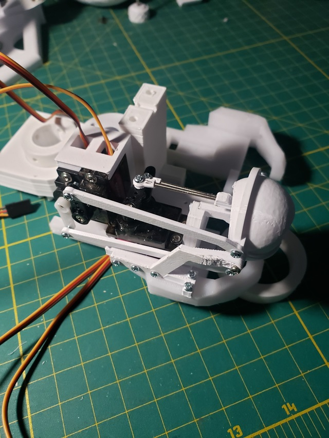

<!DOCTYPE html>
<html>
<head>
</head>
<body>

<h2>i2head assembly steps</h2>

My steps for assembly of the i2head. 

*** Disclaimer ***  This is not an official guide, just what I worked through during the intial release of the new i2head.

<h3>Base</h3>

Fit FaceHolderLeft and FaceHolderRight to GearHolderV3.  These can then be glued to form a permanent assembly. 

Tap the 8 eye assembly mountings holes for 2mm screws

Suggest at this point test fit and sand the ServoGear and MainGear for a smooth fit and gear teeth action.

Notes if this is still an issue.  The mounting holes on the FaceHolderLeft and FaceHolderRight for the upper teeth plate are not aligned properly.  In the side by side photos the right is the original for clarity. The left with the indicated markings are where I redrilled once the lower jaw assembly was mounted.  

 
 

 
*** Steps being added here as rebuild continues ***

Much later....

Attach completed eye assemblies from i2eyes guide using 2mm x 8mm screws

</body>

</html>

